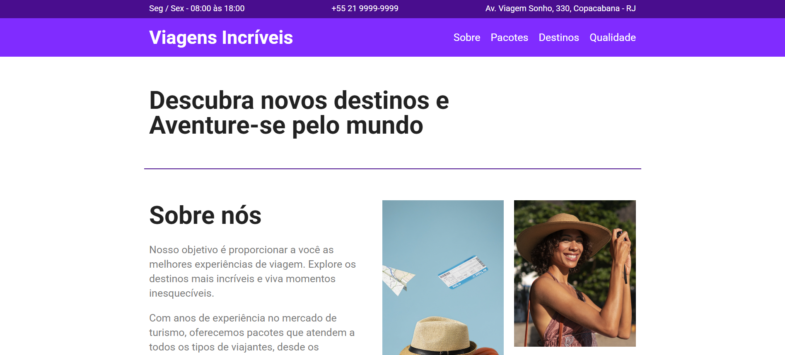

<h1 align="center" style="font-weight: bold;">Site de viagens com flexbox 💻</h1>

 <a href="#tech">Technologies</a> • 
 <a href="#started">Getting Started</a> 

    <b>Site de viagens ultilizando as propriedades do flexbox</b>

<h2 id="layout">🎨 Layout</h2>

    
    
    

<h2 id="technologies">💻 Technologies</h2>
<ul>
 <li>HTML</li>
 <li>CSS - Flexbox </li>
</ul>

<h2 id="started">🚀 Getting started</h2>

<h3>Prerequisites</h3>
<ul>
 <li>NodeJS</li>
 <li>Git</li>
</ul>

<h3>Cloning</h3>

How to clone your project

git clone https://github.com/Raissamarq/flexbox-study

<h3>Starting</h3>

<ol>
 <li>open index.html</li>
</ol>

Projeto proposto pelo curso CSS Flexbox da Alura

